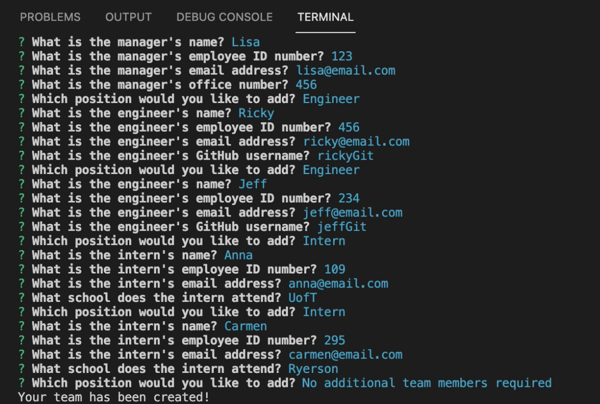
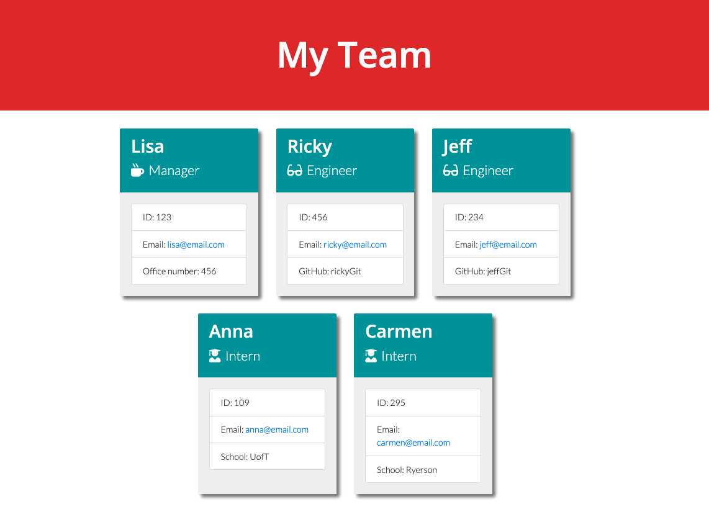
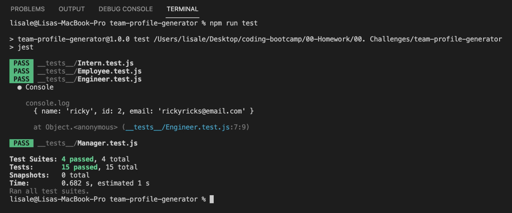

# Team Profile Generator
[](https://opensource.org/licenses/MIT)

## Description
The focus of this is around Object Orientated Programming and unit testing. The objective was build a Node.js command-line application that takes in information about employees on a software engineering team and generates an HTML webpage that displays summaries for each person.

## Contents
- [Installation](#installation)
- [Usage](#usage)
- [Demo](#demo)
- [Built With](#built-with)
- [Tests](#tests)
- [Questions](#questions)
- [Credits](#credits)

## Installation
To install all the dependencies, use the command below

```
npm  install inquirer
```

## Usage
To use this application, clone the repository to your local machine:
```
git clone git@github.com:lisahuele/team-profile-generator.git
```

Then, ensure you have installed the dependencies with the command:
```
npm  install inquirer
```

When you are ready to run the application, from the root directory, type the command:
```
node index
```

Proceed to follow the prompted provided in the terminal. Afterwards, an html file will generate in the `output` directory.

## Demo
Click the link below for a video demonstration of the application.


What the command-line interface looks like:


What the front-end interface will look like:


## Built With
- Node.js
- Bootstrap
- Jest
- Inquirer

## Tests
To run the tests for this application, install jest:
```
npm install jest
```

Then, enter the following command:
```
npm run test
```

What the tests passing looks like:


## Questions
If you have any questions about the repo, please contact me via email at lisahuele@gmail.com. You can find more of my work on my GitHub, [lisahuele](https://github.com/lisahuele).

## Credits
Created by Lisa Le.
